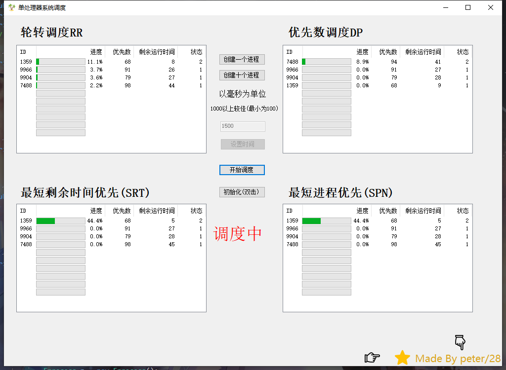

# 单处理器系统的四种调度方法

操作系统课程设计

# 使用方法

根据按钮进行操作。

因为添加了背景之后 程序有点卡顿，所以删除了

运行OSS_EXP4\bin\debug\OSS_EXP4.exe 即可。（如果不能运行，可能是缺少.NET FrameWork）

# 不足
本来找到了向ListView里添加ProgressBar的方法，但是不能很好的控制，应该自定义控件才是最好的解决方法。有时候会改用自定义控件进行解决。

